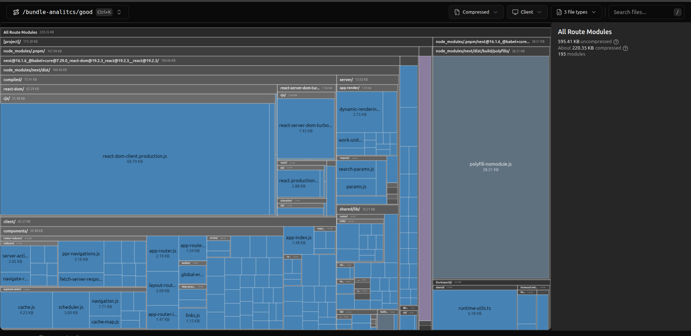
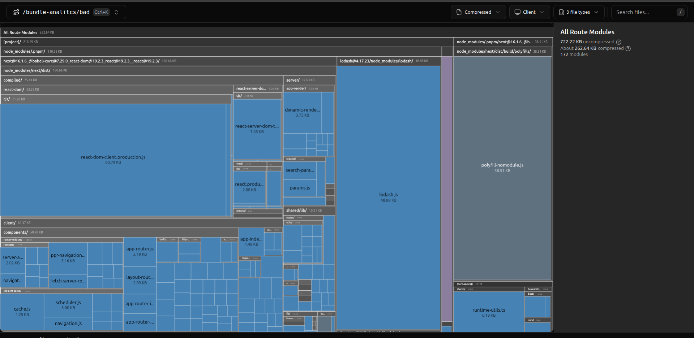
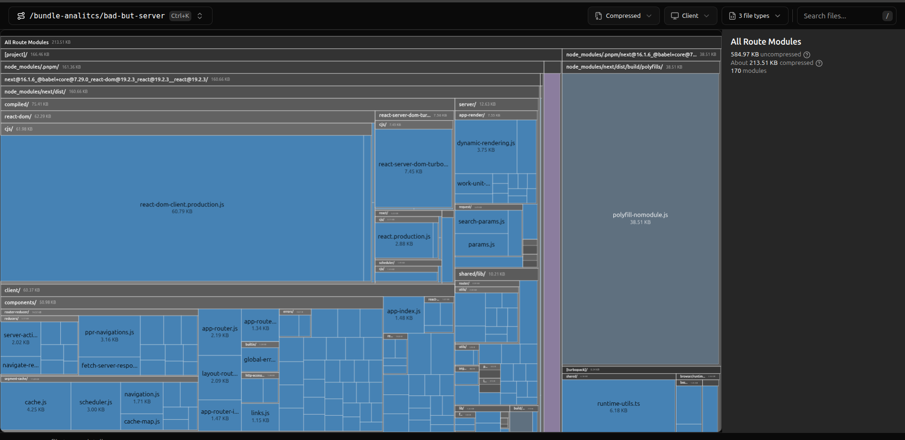

# Verificando o bundle

Rode o comando
```bash
pnpm run build:analyze
```

Evite importar bibliotecas pesadas em componentes com use client.


# Exemplo ./good

Neste exemplo realizamos um import mais especifico, e isso carrega apenas o recurso kebabCase do loadash, retornando **595kb** de recursos



==========

O Exemplo de bad, importa toda a biblioteca do lodash e usa apenas o kebabCase, por isso é pesado no bundle, retornando **722kb**




==========

O exemplo bad-but-server simula um caso pesado com o import ruim, como se fosse a unica solução, porém o componente é renderizado no servidor e apenas o HTML é retornado, isso aumenta o custo de infra, porém retorna apenas **584kb**,





==========

Uma outra forma é o bad-but-utility-server, de deixar o recurso como um utilitário server only, isso retorna apenas **584kb**, igual ao caso de cima


